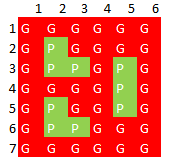
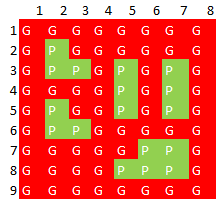

# Business and War
In a parallel Universe of Web Series there are two famous Underworld Don First one is Guddu Pandit, King of Mirzapur from Mirzapur and the second one is Ganesh Gaitonde, Gangster of Mumbai from Sacred Games. 
Once Guddu Pandit thought for extending there Business from UP to Maharashtra so he decided to do a Business deal with Ganesh Gaitonde and he sends some of his gangster men to Mumbai. <br/>
Now the twist in story is, there is also a another Gangster in Bihar, named Dadda Tyagi who doesn't like this deal because he don't wants to see guddu pandit growth and also somehow he wants to kill Guddu Pandit so that he can rule over Mirzapur, that's why somehow he managed to create confusion in Gaitonde's mind, that guddu pandit is secretly sending some of his men to kill you and he wants to rule over your Mumbai.  
 <br/>
Now, as Mumbai is under Gaitonde's control so he easily kidnapped all of guddu pandit's men who came here for business deal. afterthen a spy agent of guddu pandit told him that gaitonde has kidnapped all of their mates and sends him a graphical representation of location where gaitonde kept those kidnapped men.
 
 Graphical Representation is as Follows:- </br>
 It will consists of m x n matrix representing whole Mumbai, where G denotes Gaitonde's army and P surrounded by G denotes they are Guddu Pandit's army kidnapped by Gaitonde.
 
 G G G G G G</br>
 G P G G P G</br>
 G P G G G G</br>
 G G G P P G</br>
 G G G G G G</br>
 
It is Guaranteed that all of the P must be inside G surrounded by all four direction.
 
 
 
 
### Constraints
### Input Format 
```
First Line will Contains dimension of matrix m x n
Now next m rows and n columns will Contains either P or G
P denotes Guddu Pandit's Army and G denotes Ganesh Gaitonde's Army
```

### Output Format 
```
Output the minimum number of region where Guddu Pandit have to send their more army to save his kidnapped men and Number of his men who was kidnapped.
```

### Sample Input 1
7 6 </br>
G	G	G	G	G	G</br>
G	P	G	G	G	G</br>
G	P	P	G	P	G</br>
G	G	G	G	P	G</br>
G	P	G	G	P	G</br>
G	P	P	G	G	G</br>
G	G	G	G	G G</br>


### Sample Output 1
3 9<br/>
<br/>
It is Obvious to see from Graphical Representation that there is total 3 different Places where Gaitonde kept those all 9 Kidnapped men.
### Sample Input 2
9 8 </br>
G	G	G	G	G	G	G	G</br>
G	P	G	G	G	G	G	G</br>
G	P	P	G	P	G	P	G</br>
G	G	G	G	P	G	P	G</br>
G	P	G	G	P	G	P	G</br>
G	P	P	G	G	G	G	G</br>
G	G	G	G	G	P	P	G</br>
G	G	G	G	P	P	P	G</br>
G	G	G	G	G	G	G	G</br>

### Sample Output 2
5 17<br/>
<br/>
It is Obvious to see from Graphical Representation that there is total 5 different Places where Gaitonde kept those all 17 Kidnapped men.
